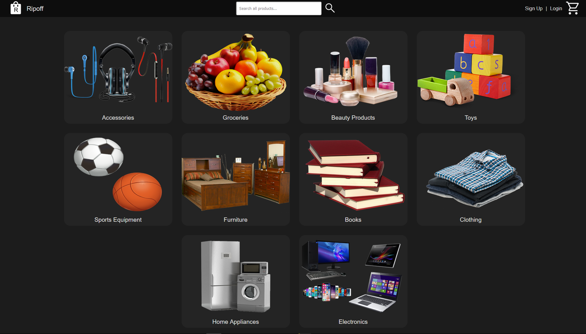

# RipOff

## What is RipOff?

Ripoff is a webshop that was made especially to rip people off and steal their money without sending them the products they ordered.

## Screenshots
- index.html


### Functional requirements:
- create a user account, login
- Login, forgot pw, chnage pw, change username (can't have duplicate emails).
- account information needs to be secure.
- Able to view & order products / services
- using filters to choose products / services
- order(customerNo, order_id, order_details, products in this order)
- order confirmation -> PDF To EMAIL
- store bill in DB (No real transactions)
- shopping cart, past purchases, show products in your basket.....
-----------
### Technical requirements:
- WAMPSERVER, Mysql, Mysql packages
- Design a database
- No hard coding information, no duplicate JS code.
- Node.js / Axios / JSON.
----------
### Timeline: Until 07/09/2024
Submission: All of your code (HTML, CSS, JS, SQL, MP4 Video that contains a demo of the website and the code design)
Notes: CSS design matters, "do not design an ugly website".

# PDF Example (pdfkit node.js module)
- (from the documentation of pdfkit Nodejs module)
```js
import PDFDocument from'pdfkit';
import fs from 'fs';
```
### Create a document
```js
const doc = new PDFDocument();
```
- Pipe its output somewhere, like to a file or HTTP response
```js
doc.pipe(fs.createWriteStream('output.pdf'));
```
- Embed a font, set the font size, and render some text
```js
doc
  .font('fonts/PalatinoBold.ttf')
  .fontSize(25)
  .text('Some text with an embedded font!', 100, 100);
```
- Add an image, constrain it to a given size, and center it vertically and horizontally
```js
doc.image('path/to/image.png', {
  fit: [250, 300],
  align: 'center',
  valign: 'center'
});
```
- Add some text with annotations
```js
doc
  .addPage()
  .fillColor('blue')
  .text('Here is a link!', 100, 100)
  .underline(100, 100, 160, 27, { color: '#0000FF' })
  .link(100, 100, 160, 27, 'http://google.com/');
```
### Finalize PDF file
```js
doc.end();
```

### JS docs
- Simulate a mouse click:
```js
window.location.href = "http://www.w3schools.com";
```
- Simulate an HTTP redirect:
```js
window.location.replace("http://www.w3schools.com");
```

<!-- 
  -- Reverse sort order in Products.html page
  -- red noti text
  -- Top sales in index
  -- 5 categories per row in home page
  -- add product price to product.html
  -- Create PDF File.
  -- add Dowmload PDF button
  -- Send Email
 -->