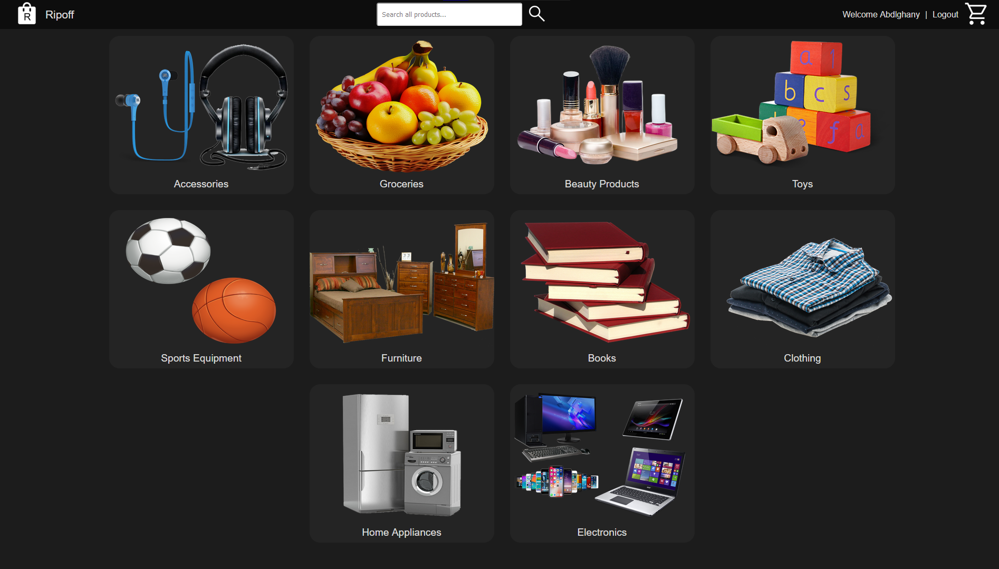
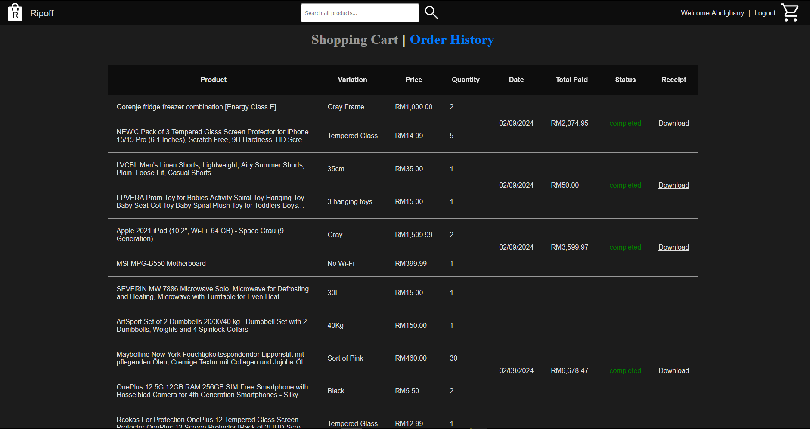

# RipOff


## Table of contents

- [What is RipOff?](#what-is-ripoff)
- [Screenshots](#screenshots)
- [Run this website](#run-this-website)
- [1 hour video demonstration](#video-demo)
## What is RipOff?

Ripoff is a webshop that was made especially to rip people off and steal their money without sending them the products they ordered.

## Screenshots

#### Home page [index.html](Client/index.html)



#### Signup page [signup.html](Client/signup.html)


#### Login page [login.html](Client/login.html)


#### Shopping Cart Page [cart.html](Client/cart.html)

##### Empty Shopping Cart


##### Full Shopping Cart


##### Empty order history


##### Full order history



### Products page [products.html](Client/products.html)


#### Sort menu


#### Search example


### Singular product page [product.html](Client/product.html)


### User profile page [user.html](Client/user.html)

#### User profile without addresses shown


#### User profile with addresses shown 


### Add new address page [addaddress.html](Client/addaddress.html)


### Edit address (Same HTML page as add)


## Run this website

- Install XAMPP, You can get XAMPP from [apachefriends.org/download.html](https://www.apachefriends.org/download.html)

- Install node.js from [https://nodejs.org/en/download/prebuilt-installer](https://nodejs.org/en/download/prebuilt-installer)

- Clone the repo: open command prompt and navigate to
```/xampp/htdocs/```
then run the command
``` git clone https://github.com/abdlghany/Status200 ```
- Launch XAMPP, startup the Apache and MySQL services, then Import the database and its tables from [ripoff.sql](./Server/ripoff.sql) into your MySQL database at [localhost/phpmyadmin](localhost/phpmyadmin)

- navigate to [/xampp/htdocs/Status200/Ripoff/Server/](/xampp/htdocs/Status200/Ripoff/Server/) and open a command prompt there, then run the command
```bash
node server.js
```

if you did everything correctly you should see
```bash
Listening on port 3000...
Connected to the database.
```
in your command prompt

- Congratulations! the server is now running and you can access the website via this link 
[localhost/Status200/Ripoff/Client](http://localhost/Status200/Ripoff/Client) (The link might differ for you).


## Documentations for the used PDF Node Module.

Importing the file into the app
```js
import PDFDocument from'pdfkit';
import fs from 'fs';
```
### Create a document
```js
const doc = new PDFDocument();
```
- Pipe its output somewhere, like to a file or HTTP response
```js
doc.pipe(fs.createWriteStream('output.pdf'));
```
- Embed a font, set the font size, and render some text
```js
doc
  .font('fonts/PalatinoBold.ttf')
  .fontSize(25)
  .text('Some text with an embedded font!', 100, 100);
```
- Add an image, constrain it to a given size, and center it vertically and horizontally
```js
doc.image('path/to/image.png', {
  fit: [250, 300],
  align: 'center',
  valign: 'center'
});
```
- Add some text with annotations
```js
doc
  .addPage()
  .fillColor('blue')
  .text('Here is a link!', 100, 100)
  .underline(100, 100, 160, 27, { color: '#0000FF' })
  .link(100, 100, 160, 27, 'http://google.com/');
```
### Finalize PDF file
```js
doc.end();
```

## Video demo

[](https://youtu.be/mILr_8HvMG4)
